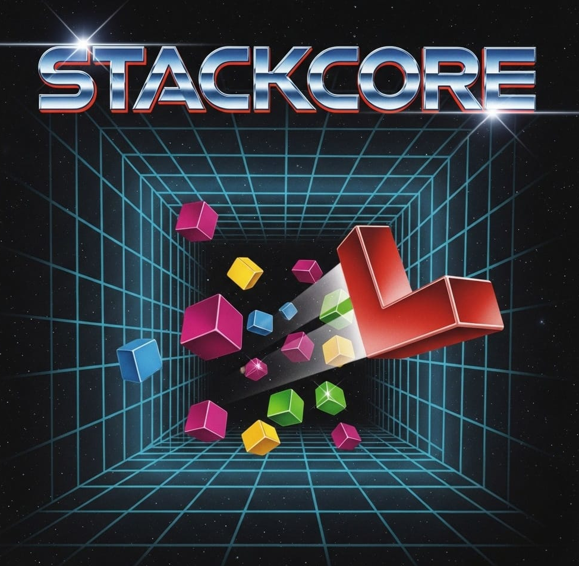

# StackCore

{width=700}

A modern C++ recreation of the classic 1989 Blockout game - the 3D version of Tetris! Built with Raylib for high performance and modern architectural standards. Navigate falling 3D blocks in a pit, rotating them in all dimensions to create complete horizontal layers.

## 🎮 Game Features

- **3D Block Puzzle**: Experience Tetris in three dimensions (9x9x9 grid).
- **9 Block Types**: From simple cubes to complex shapes (I, L, T, cross, 2x2 cube).
- **Full 3D Rotation**: Rotate blocks around X, Y, and Z axes.
- **Classic Mechanics**: Clearing a full layer (81 cubes) removes it and drops everything above, just like the original 1989 classic.
- **Bot AI (Demo Mode)**: Watch a high-performance AI play the game using a predictive evaluation algorithm.
- **Ghost Block**: Visualize exactly where your piece will land.
- **Next Block Preview**: Plan ahead with a queue of upcoming blocks.
- **Progressive Difficulty**: Dynamic speed increase and level progression.
- **Dynamic Camera**: Rotate the entire board to find the best perspective.
- **Retro UI**: Modern interface with an LCD-style feel using ImGui.refactoricemos la lógica para hacerla como el Tetris 3D clásico

## 🛠️ Technology Stack

- **Language**: C++17
- **Graphics & Audio**: [Raylib 5.0+](https://www.raylib.com/)
- **GUI**: [Dear ImGui](https://github.com/ocornut/imgui) + [rlImGui](https://github.com/raylib-extras/rlImGui)
- **Architecture**: Decoupled systems (AudioManager, Renderer, InputHandler, Board logic).
- **Build System**: Makefile (cross-platform).

## 🎯 Game Mechanics

- **Grid**: 9x9 horizontal grid with 9 levels of depth.
- **Goal**: Fill a complete 9x9 layer (81 cubes) to clear it.
- **Controls**: 
  - `Arrows` - Move block in X/Y plane.
  - `W / S` - Rotate block around X axis.
  - `A / D` - Rotate block around Y axis.
  - `Q / E` - Rotate block around Z axis.
  - `Space` - Hard Drop (instant land).
  - `CTRL + WASD` - Rotate camera/board perspective.
  - `TAB` - Toggle AI Bot (Demo Mode).
  - `F1` - Toggle Help Window.
  - `H` - Toggle Ghost Block.
  - `N` - Toggle Next Blocks Preview.
  - `P` - Pause game.
  - `M` - Toggle sound.
  - `R` - Reset game.
  - `ESC` - Exit game.

## 📋 Requirements

### Linux
```bash
# Ubuntu/Debian
sudo apt-get update
sudo apt-get install build-essential pkg-config libraylib-dev
```

### Windows
- MinGW-w64 with C++17 support.
- Raylib development libraries (static linking supported in Makefile).

## 🚀 Installation & Building

### Quick Start (Linux)
```bash
# Clone the repository
git clone https://github.com/movidirect/stackcore.git
cd stackcore

# Build the game
make linux

# Run the game
./Output/stackcore
```

### Windows Build
```bash
# Use MinGW and make
make windows

# Run the game
./Output/stackcore.exe
```

## 📁 Project Structure (Decoupled Architecture)

```
StackCore/
├── src/                 # Source code
│   ├── main.cpp        # Entry point
│   ├── Game.cpp/.h     # Game Controller (Orchestrator)
│   ├── Board.cpp/.h    # Board logic & Collision engine
│   ├── Renderer.cpp/.h # Raylib 3D/2D Rendering system
│   ├── AudioManager.*  # Raylib Sound & Music management
│   ├── InputHandler.*  # Input abstraction (Player/Bot)
│   ├── BotAI.cpp/.h    # Predictive AI algorithm
│   ├── Block.cpp/.h    # 3D Polyminó management
│   ├── Cube.cpp/.h     # Individual cube handling
│   ├── Data.cpp/.h     # High score & Save state persistence
│   ├── State.cpp/.h    # ImGui UI Layouts
│   └── Utils.cpp/.h    # Mathematical & Mapping utilities
├── Output/             # Game assets and executable
│   ├── fonts/         # Fonts
│   ├── images/        # Textures & Icons
│   └── sounds/        # Audio files (MP3)
├── imgui/             # Dear ImGui & rlImGui backend
├── include/           # External headers (Raylib)
├── lib/               # External libraries (Raylib)
└── Makefile          # Cross-platform build configuration
```

## 🤝 Contributing

Contributions are welcome! Please feel free to submit a Pull Request.

## 📝 License

This project is licensed under the GPL-3.0 - see the [LICENSE](LICENSE) file for details.

## 🙏 Acknowledgments

- Original **Blockout** game (1989) for the inspiration.
- **Raylib** for the amazing "no-nonsense" graphics library.
- **Dear ImGui** for the powerful debug and game UI.

---

**Enjoy playing StackCore!** 🎮
